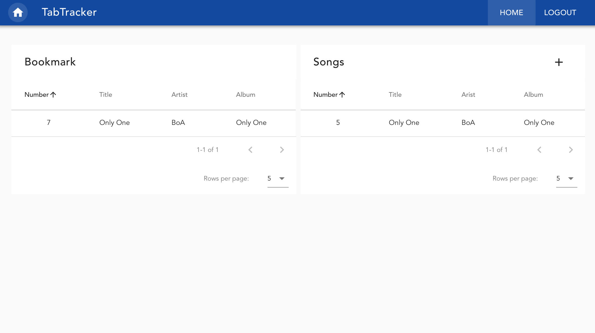
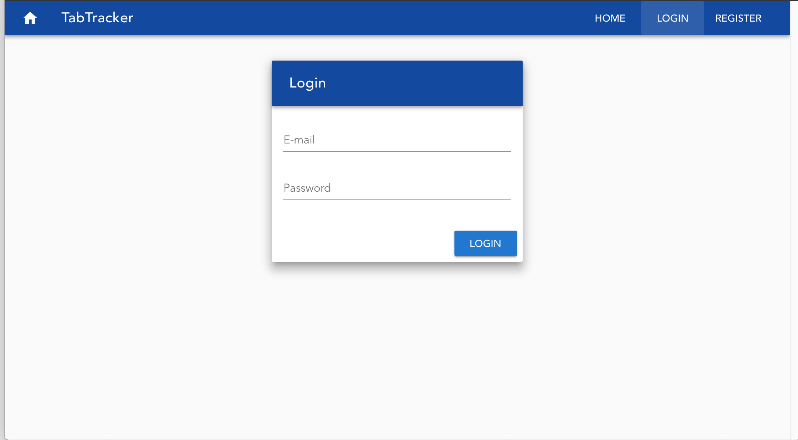
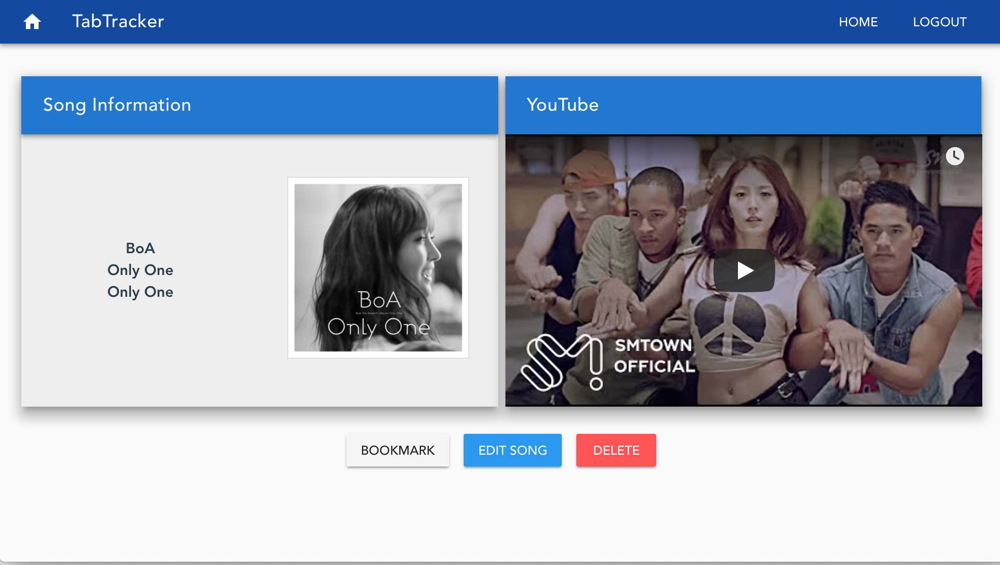

# tab-tracker

A Vue.js and Express.js application - tutorial

This project is following Cody Seibert's Tutorial on a Vue.Js and Express on FreeCodeCamp with a couple of flavors of my own.

The code has been refacatored and rewritten based on my new learnings in September. Functionality that was not being used are removed.

## Screenshots

### Home

### Login

### Register

### Song Information

